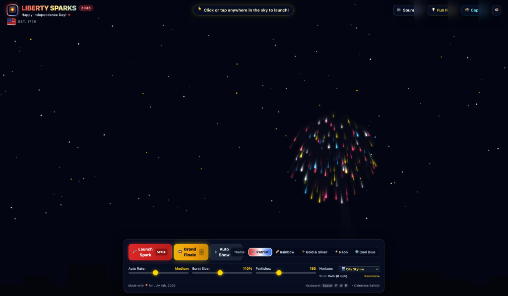

<div align="center">
  <h1>🎆 LIBERTY SPARKS • 2026</h1>
  <p><strong>A World-Class, Interactive 4th of July Fireworks Experience & Particle Effects Engine</strong></p>

  <p>
    <a href="#-features">Features</a> •
    <a href="#-quick-start">Quick Start</a> •
    <a href="#-controls--shortcuts">Controls</a> •
    <a href="#-technical-highlights">Technical Highlights</a>
  </p>

  <br />
  
  <!-- HERO IMAGE -->
  

  <br /><br />
</div>

---

## 🌟 Overview

**Liberty Sparks** is a celebratory, self-contained single-file HTML5 web application created for the **4th of July**. Built from scratch with vanilla JavaScript and styled with Tailwind CSS, it transforms any web browser into a vibrant, high-performance fireworks celebration.

Whether you're hosting an Independence Day party, looking for a festive screen saver, or simply love interactive particle physics, Liberty Sparks delivers realistic sound synthesis, dynamic horizon reflections, and customizable color themes without requiring any external dependencies or audio files.

---

## ✨ Features

### 🎇 World-Class Particle & Physics Engine (60 FPS)
- **Rocket Phase:** Rockets shoot upward from the horizon with aerodynamic wobble and glowing spark trails, accelerating toward your click or tap coordinates.
- **Explosion Phase:** Detonations spawn radiating particle clouds that obey natural physics—including air resistance (friction), downward gravity, wind drift, and sparkle flicker.
- **Additive Blending & Motion Trails:** Uses HTML5 Canvas `globalCompositeOperation = 'lighter'` combined with particle position histories to create intense luminous cores and tapered strobe trails.
- **Diverse Burst Styles:** Randomly generates Classic Sphere bursts, Saturn/Ring bursts, cascading Brocade/Willow gold trails, and multi-color Double Bursts.

### 🔊 Procedural Web Audio API Sound Synthesis
- **Zero External Assets:** All audio is synthesized procedurally in real-time using the browser's Web Audio API.
- **Realistic Acoustics:** Features rising bandpass whooshes, deep sub-bass oscillator booms (`110Hz → 28Hz`), atmospheric crack bursts, and lingering high-frequency micro-pops.

### 🎨 Patriotic Glassmorphism UI & Custom Themes
- **Modern Design:** Sleek semi-transparent glassmorphic panels (`backdrop-blur-md`), glowing neon accents, and responsive controls.
- **5 Color Themes:**
  - **🇺🇸 Patriot (Default):** Crimson Red, Bright White, Electric Blue, and Gold.
  - **🌈 Rainbow:** Vibrant full-spectrum neon colors.
  - **✨ Gold & Silver:** Warm champagne, pure gold, and silver sparkles.
  - **⚡ Neon:** Cyberpunk magenta, electric lime, and cyan.
  - **❄️ Cool Blue:** Ice blue, sapphire, and royal white.

### 🏞️ Interactive Environments & Details
- **Dynamic Horizons:** Select between a **City Skyline** (with illuminated window lights), a **Calm Lake Reflection** (where exploding fireworks cast expanding water ripples), a **Statue of Liberty Silhouette**, or a **Pure Night Sky**.
- **Twinkling Starfield:** Over 140 individually seeded background stars with randomized sizes and pulsing twinkle cycles.
- **💡 4th of July Trivia:** Explore rotating historical and scientific facts about Independence Day and fireworks.
- **📸 Capture the Moment:** Instant camera shutter flash animation that generates and downloads a high-resolution PNG screenshot of your custom display.
- **🎆 Grand Finale Spectacular:** Triggers a synchronized 25-shell barrage with a glowing top banner announcement!
- **👁️ UI Toggle:** Hide all controls for a pure, unobstructed fireworks display.

---

## 🚀 Quick Start

Because Liberty Sparks is completely self-contained, getting started is effortless:

### Option 1: Direct File Open
Simply clone or download this repository and open `index.html` directly in any modern web browser:
```bash
git clone https://github.com/hamilto8/fireworks.git
cd fireworks
open index.html # on macOS (or double-click the file)
```

### Option 2: Local Server
If you prefer running a local development server:
```bash
# Using Python
python3 -m http.server 8000

# Or using Node / npx
npx serve .
```
Then visit `http://localhost:8000` in your browser.

---

## 🎮 Controls & Shortcuts

| Key / Input | Action |
| :--- | :--- |
| **Click / Tap** | Launch a firework to the exact cursor location |
| <kbd>Space</kbd> | Launch a randomized spark |
| <kbd>F</kbd> | Trigger the **Grand Finale** show |
| <kbd>A</kbd> | Toggle **Auto Show** continuous party mode |
| <kbd>M</kbd> | Mute / Unmute procedural sound |
| <kbd>C</kbd> | Capture screenshot & download PNG |
| <kbd>H</kbd> | Hide / Show UI control panels |

---

## 🛠️ Technical Highlights

- **Single-File Architecture:** All styles, templates, audio synthesis scripts, and particle physics engines reside within a clean, well-commented `index.html` file (~600 lines).
- **Tailwind CSS Play CDN:** Configured with custom patriotic color tokens, keyframe animations (`float`, `wave`), and dark mode defaults.
- **Memory Management:** Efficient particle array pooling and garbage collection ensure smooth 60 FPS rendering across mobile, tablet, and desktop screens.

---

<div align="center">
  <p>Made with 💥 for July 4th, 2026 • Celebrate Safely!</p>
</div>
